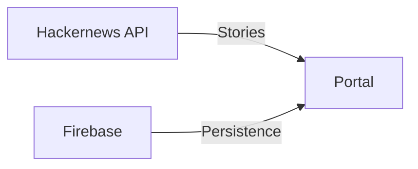

<a name="readme-top"></a>

<!-- PROJECT SHIELDS -->

[![Contributors][contributors-shield]][contributors-url]
[![Forks][forks-shield]][forks-url]
[![Stargazers][stars-shield]][stars-url]
[![Issues][issues-shield]][issues-url]
[![MIT License][license-shield]][license-url]

<!-- PROJECT LOGO -->
<br />
<div align="center">
  <h3 align="center">The Hacker Times</h3>

  <p align="center">
    An Angular implementation of Hackernews with <a href="https://www.nytimes.com/">NY Times</a> vibe.
    <br />
    <a href="https://github.com/data-miner00/ng-hackernews"><strong>Explore the docs »</strong></a>
    <br />
    <br />
    <a href="https://github.com/data-miner00/ng-hackernews">View Demo</a>
    ·
    <a href="https://github.com/data-miner00/ng-hackernews/issues">Report Bug</a>
    ·
    <a href="https://github.com/data-miner00/ng-hackernews/issues">Request Feature</a>
  </p>
</div>

<!-- TABLE OF CONTENTS -->
<details>
  <summary>Table of Contents</summary>
  <ol>
    <li>
      <a href="#about-the-project">About The Project</a>
      <ul>
        <li><a href="#built-with">Built With</a></li>
        <li><a href="#design">Design</a></li>
      </ul>
    </li>
    <li>
      <a href="#getting-started">Getting Started</a>
      <ul>
        <li><a href="#prerequisites">Prerequisites</a></li>
        <li><a href="#installation">Installation</a></li>
      </ul>
    </li>
    <li><a href="#usage">Usage</a></li>
    <li><a href="#roadmap">Roadmap</a></li>
    <li><a href="#contributing">Contributing</a></li>
    <li><a href="#license">License</a></li>
    <li><a href="#acknowledgments">Acknowledgments</a></li>
  </ol>
</details>

> I believe beautiful web apps can be made with Angular too 💕

<!-- ABOUT THE PROJECT -->

## About The Project


A simple implementation of the Hackernews interface in Angular using the official [Hackernews API](https://github.com/HackerNews/API). Project started out on 2021 and still haven't completed in 2023. The feature includes authentication via Firebase Auth and save any of the post to "read later" list.


The listing page for **Top Stories**, **Ask Stories**, **Show Stories** and **Job Stories**.


The page for an individual story with info and discussions.

<p align="right">(<a href="#readme-top">back to top</a>)</p>

### Built With

The technologies and tools used within this template.

- Angular
- Sass
- TypeScript
- Jasmine/Karma
- Firebase
- Circle CI

<p align="right">(<a href="#readme-top">back to top</a>)</p>

<!-- DESIGN -->

### Design

There are not much design considerations when it comes to this project and hence very straightforward and simple. The portal itself consumes the data from Hackernews API and persistence via Firebase.



<p align="right">(<a href="#readme-top">back to top</a>)</p>

<!-- GETTING STARTED -->

## Getting Started

### Prerequisites

The list of tools that is used when development.

- npm
  ```sh
  npm install npm@latest -g
  ```
- [Git](https://git-scm.com/downloads)

### Installation

Installation is fairly straightforward. Just clone the repo and `npm i && npm start`. For first timers, gather the newly created Firebase credentials and replace the credentials in `.env.example` and save them in a new file named `.env`.

1. Clone the repo
   ```sh
   git clone https://github.com/data-miner00/ng-hackernews.git
   ```
2. Install Node dependencies
   ```sh
   npm i
   ```
3. Recommend to run tests to check if things are breaking
   ```sh
   npm test
   ```
4. Start local dev server
   ```sh
   npm start
   ```
5. Compile for production
   ```sh
   npm build
   ```

<p align="right">(<a href="#readme-top">back to top</a>)</p>

<!-- ROADMAP -->

## Roadmap

- [x] Implement carousel
- [ ] Add Pexels API for image
- [x] Implement individual page
- [x] Implement the favourite page
- [x] Implement the watch later page
- [ ] Use mixin for repetead css
- [x] Implement better footer
- [ ] Implement 404 page
- [x] Enhance Login page and Register page (Phase I)
- [ ] Implement User Page
- [ ] Add upvote count to comment
- [ ] Implement random page
- [x] Hydrate landing page
- [ ] Add linter
- [x] Add formatter
- [ ] Achieve 85% code coverage
- [ ] Improve responsiveness
- [ ] Use RxJs ShareReplay to cache results

See the [open issues](https://github.com/data-miner00/ng-hackernews/issues) for a full list of proposed features (and known issues).

<p align="right">(<a href="#readme-top">back to top</a>)</p>

<!-- CONTRIBUTING -->

## Contributing

> I am bad at design, please help if you can design it better!

Contributions are what make the open source community such an amazing place to learn, inspire, and create. Any contributions you make are **greatly appreciated**.

If you have a suggestion that would make this better, please fork the repo and create a pull request. You can also simply open an issue with the tag "enhancement".
Don't forget to give the project a star! Thanks again!

1. Fork the Project
2. Create your Feature Branch (`git checkout -b feature/AmazingFeature`)
3. Commit your Changes (`git commit -m 'Add some AmazingFeature'`)
4. Push to the Branch (`git push origin feature/AmazingFeature`)
5. Open a Pull Request

<p align="right">(<a href="#readme-top">back to top</a>)</p>

<!-- LICENSE -->

## License

Distributed under the MIT License. See `LICENSE` for more information.

<p align="right">(<a href="#readme-top">back to top</a>)</p>

<!-- ACKNOWLEDGMENTS -->

## Acknowledgments

List of resources that are helpful and would like to give credit to.

- [Using Different Layout Frames For Different Routes In Angular](https://javascript.plainenglish.io/using-different-layout-frames-for-different-routes-in-angular-d96ed096c633)
- [How to Unit Test an HTTP Service in Angular](https://braydoncoyer.dev/blog/how-to-unit-test-an-http-service-in-angular)
- [unit-testing for values set async in ngOnInit() function of an angular component](https://stackoverflow.com/questions/44294960/unit-testing-for-values-set-async-in-ngoninit-function-of-an-angular-component)

<p align="right">(<a href="#readme-top">back to top</a>)</p>

<!-- MARKDOWN LINKS & IMAGES -->

[contributors-shield]: https://img.shields.io/github/contributors/data-miner00/ng-hackernews.svg?style=for-the-badge
[contributors-url]: https://github.com/data-miner00/ng-hackernews/graphs/contributors
[forks-shield]: https://img.shields.io/github/forks/data-miner00/ng-hackernews.svg?style=for-the-badge
[forks-url]: https://github.com/data-miner00/ng-hackernews/network/members
[stars-shield]: https://img.shields.io/github/stars/data-miner00/ng-hackernews.svg?style=for-the-badge
[stars-url]: https://github.com/data-miner00/ng-hackernews/stargazers
[issues-shield]: https://img.shields.io/github/issues/data-miner00/ng-hackernews.svg?style=for-the-badge
[issues-url]: https://github.com/data-miner00/ng-hackernews/issues
[license-shield]: https://img.shields.io/github/license/data-miner00/ng-hackernews.svg?style=for-the-badge
[license-url]: https://github.com/data-miner00/ng-hackernews/blob/master/LICENSE
[product-screenshot]: images/screenshot.png
